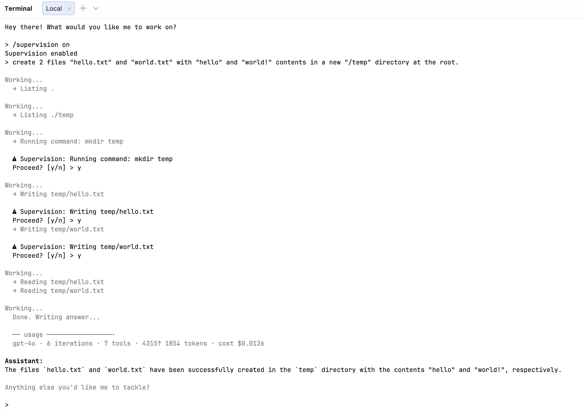
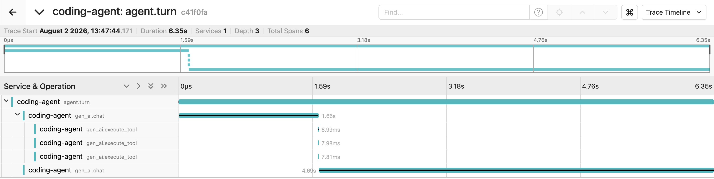

# coding-agent
Implementation of a coding agent in Go, including a harness, conversation mode, plan mode, and supervision mode.

## Requirements
- Go 1.26+
- An [OpenAI API key](https://platform.openai.com/api-keys)
- A [Tavily API key](https://tavily.com) (for web search)

## Setup

1. Clone the repo and install dependencies:
   ```bash
   git clone https://github.com/lucasmonteverdi1/coding-agent
   cd coding-agent
   go mod download
   ```

2. Copy the env template and fill in your API keys:
   ```bash
   cp .env.example .env
   ```
   ```
   OPENAI_API_KEY=sk-...
   TAVILY_API_KEY=tvly-...
   ```

## Run

```bash
go run .
```

The agent starts an interactive REPL. Type a task in natural language and press Enter.

For tasks that require reading many files, increase the iteration cap:

```bash
go run . --max-iterations 100
```

| Flag | Default | Description |
|---|---|---|
| `--max-iterations` | `50` | Maximum tool-loop iterations per turn |
| `--otel` | `false` | Export OpenTelemetry traces and metrics |
| `--otel-endpoint` | `localhost:4317` | OTLP/gRPC collector endpoint |
| `--pricing-config` | `pricing.config.json` | Path to the per-model pricing file |

## Using outside this repo

### Download a prebuilt binary

Grab the archive for your platform from the [Releases](https://github.com/lucasmonteverdi1/coding-agent/releases) page, then:

```bash
tar -xzf coding-agent_*.tar.gz
mv coding-agent /usr/local/bin/
```

### Or build from source

```bash
go build -o coding-agent .
mv coding-agent /usr/local/bin/
```

Then launch it from any directory:

```bash
cd ~/your-project
coding-agent
```

The agent sandboxes itself to the directory it was launched from. Since `.env` files are project-local, set your API keys in your shell profile instead:

```bash
export OPENAI_API_KEY=sk-...
export TAVILY_API_KEY=tvly-...
export OPENAI_MODEL=gpt-4o  # optional, defaults to gpt-4o
```

## Commands

| Command                 | Description                              |
|-------------------------|------------------------------------------|
| `/model <name>`         | Switch model (e.g. `/model gpt-4o-mini`) |
| `/plan [on/off]`        | Plan mode on/off                         |
| `/supervision [on/off]` | Supervision mode on/off                  |
| `/quit`                 | Exit                                     |

## Observability

### Token usage and cost (no setup)

After every turn the agent reports what it consumed, read straight from the
OpenAI response metadata. Nothing to install:

```
  ── usage ─────────────────
  gpt-4o · 6 iterations · 6 tools · 6446↑ 165↓ tokens · cost $0.0178
  session: 3 turns · 10162↑ 582↓ · $0.0312
```

Prices come from `pricing.config.json` (USD per million tokens), loaded the same
way as the guardrail policy — a missing file falls back to built-in defaults. A
model with no entry reports `cost unknown` rather than `$0.00`, so an unpriced
model is visible instead of looking free.

Below, supervision mode confirms each destructive action before it runs, and the
usage block closes the turn:



### Traces and metrics (optional)

For a full trace tree the agent can export OpenTelemetry over OTLP/gRPC,
following the [GenAI semantic conventions](https://opentelemetry.io/docs/specs/semconv/gen-ai/).
Opt-in and off by default:

```bash
go run . --otel
```

Point a collector at `localhost:4317` (override with `--otel-endpoint` or
`OTEL_EXPORTER_OTLP_ENDPOINT`). If no collector is reachable the agent runs
normally — export failures never block or crash a turn.

A sample collector config is in `otel-collector.sample.yaml`:

```bash
cp otel-collector.sample.yaml otel-collector.yaml
docker run --rm -p 4317:4317 \
  -v $(pwd)/otel-collector.yaml:/etc/otelcol-contrib/config.yaml \
  otel/opentelemetry-collector-contrib:latest
```

For a visual trace tree, Jaeger accepts OTLP directly and serves a UI on
`localhost:16686`:

```bash
docker run --rm -p 16686:16686 -p 4317:4317 jaegertracing/all-in-one:latest
```

> Jaeger shows traces only. To inspect metrics, use the collector above with
> its `debug` exporter.

### Span hierarchy

```
agent.turn                     one REPL turn
└── gen_ai.chat                one iteration of the tool loop
    └── gen_ai.execute_tool    one tool call
```



When the model requests several tools in one response, they execute
concurrently and appear as sibling spans starting at the same offset — the
three `gen_ai.execute_tool` bars above. Approval prompts are serialised first
so they stay readable, then approved calls run in parallel.

The trace also shows where the time actually goes: tool execution is
milliseconds, while each `gen_ai.chat` span is seconds of model latency.

`agent.turn` carries the turn aggregates: `agent.iterations`,
`agent.tool_calls.total`, `gen_ai.usage.*`, `agent.cost.usd`, and
`agent.outcome` (`completed` / `cap_reached` / `user_rejected_plan` / `error`).
`gen_ai.chat` carries `agent.iteration.phase`, which distinguishes plan-mode
exploration from execution. `gen_ai.execute_tool` carries the guardrail
decision, approval wait time, and output size.

### Metrics

| Metric | Type | Attributes |
|---|---|---|
| `gen_ai.client.operation.duration` | Histogram (s) | model, operation |
| `gen_ai.client.token.usage` | Histogram (token) | `gen_ai.token.type` |
| `agent.tool.calls` | Counter | tool name, decision |
| `agent.turn.iterations` | Histogram | `agent.outcome` |

On spans, an unpriced model omits the `agent.cost.usd` attribute entirely,
for the same reason the terminal reports `cost unknown`.

### Privacy

No prompts, responses, or file contents are captured by default. Setting
`OTEL_GENAI_CAPTURE_MESSAGE_CONTENT=true` records them as span *events* only —
never as span or metric attributes.

## Features

- **Conversational REPL** — persistent message history across turns; the agent remembers context from previous messages
- **Tool loop** — autonomously chains tool calls until the task is complete, with a configurable iteration cap
- **Plan mode** — before acting, the agent explores the project and proposes a numbered plan for approval; supports approval, rejection, or inline revision
- **Supervision mode** — intercepts destructive actions (`write_file`, `run_command`) and asks for confirmation before executing
- **Guardrails** — always-on safety layer that blocks dangerous paths and commands, requires approval for risky ones (e.g. `git push`), and truncates oversized tool output
- **Parallel tool calls** — when the model requests several tools at once they execute concurrently; approval prompts stay sequential so the terminal remains readable
- **Usage and cost reporting** — every turn reports tokens and dollars from the API's own metadata, with a running session total
- **OpenTelemetry** — optional traces and metrics over OTLP, following the GenAI semantic conventions
- **Model switching** — swap OpenAI models at runtime without restarting
- **Configurable** — `agent.config.json` defines blocked paths, denied commands, and approval-required commands; `pricing.config.json` defines per-model token costs

## Tools

| Tool | Description | Requires confirmation |
|---|---|---|
| `read_file` | Read a file by path | No |
| `write_file` | Write or overwrite a file | Supervision mode |
| `list_files` | List contents of a directory | No |
| `run_command` | Execute a shell command (30s timeout) | Supervision mode |
| `web_search` | Search the web via Tavily | No |

## Sample run — plan mode

With plan mode on, the agent reads the codebase before proposing a numbered
plan. The user can approve, reject, or revise it before any changes are made.

```
> /plan on
Plan mode enabled
> /model gpt-5-nano
switched to gpt-5-nano
> refactor repl.go so that there are a few different messages for the agent to greet the user

Working...
  → Listing .
Working...
  → Listing internal/agent
Working...
  → Reading internal/agent/repl.go
  → Reading internal/agent/prompt.go
  → Reading internal/agent/events.go
  → Reading internal/agent/helpers.go
  → Reading internal/agent/agent.go
Working...
  → Listing internal/llm
  → Reading internal/llm/client.go
  → Listing internal/tools
  → Reading internal/tools/registry.go
  ...
Working...
  Done. Writing answer...

--- PLAN ---
1) Locate where the greeting and the next-task prompt are printed (internal/agent/repl.go).
2) Introduce two slices at package scope: greetingMessages and nextPrompts.
3) Add math/rand import and seed the RNG at RunREPL startup.
4) Modify printBanner to pick a random greeting from greetingMessages.
5) Replace the static "Anything else?" prompt with a random entry from nextPrompts.
6) Add helper functions pickGreeting() and pickNextPrompt().
7) Build and verify with go build ./...
------------
[y] approve  [n] reject  or type a revised instruction
> y
```

## License
MIT - Lucas Monteverdi 2026
